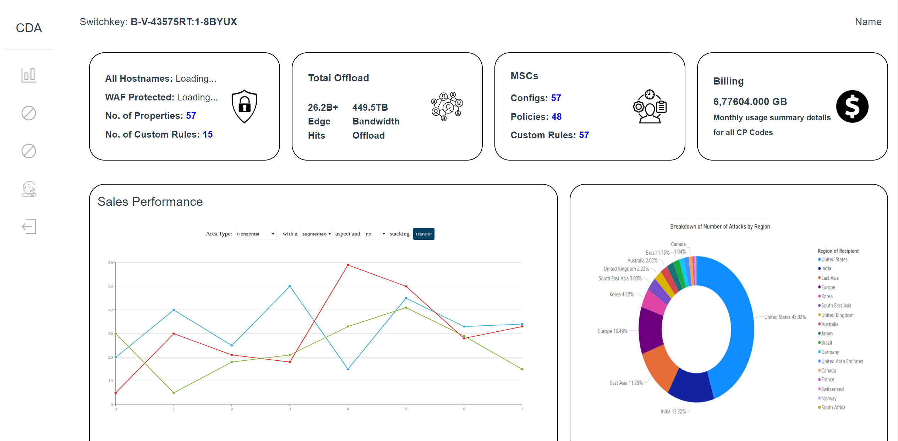

<!-- markdownlint-configure-file {
  "MD013": {
    "code_blocks": false,
    "tables": false
  },
  "MD033": false,
  "MD041": false
} -->

<div align="center">

# Welcome to CDA
A template to achieve automation

[Getting started](#getting-started) •
[Terraform templates](#terraform-templates) •
[References](#References)

</div>

## Overview

The project leverages the power of [Akamai API](https://techdocs.akamai.com/home/page/apis) to achieve instant view of account's data. Besides, it also provides us the power of automation in several manual tasks currently handled in Control Center. In this project, we simulate the automation of DV certificate with routes of action like `/listcert` `/createcert` `/modifycert`and `/deletecert`. After entering your Switchkey, you will be direct to the dashboard. 

<!--  -->
*Note: Automation actions/routes are only available in the server, which you need to further deploy on Jenkins*

## Getting Started

 * Before you can use this as a template, you need to [Create authentication credentials.](https://techdocs.akamai.com/developer/docs/set-up-authentication-credentials) Also check: [Setup Akamai Develoment Enviroment](https://techdocs.akamai.com/developer/docs/set-up-authentication-credentials)
 * You need to determine your Account Switchkey to leverage this template or to view your data
 


## Run the project on local
1. Clone this repository 
2. Add `.edgerc` file with your credentials in `akamai-cda-server` directory. Follow this guide: [Create a basic API client](https://techdocs.akamai.com/developer/docs/make-your-first-api-call)
3. **Install Dependencies** 
    - Navigate to the server directory and install dependencies:
        ```bash
        cd akamai-cda-server
        npm install
        ```
    - Navigate to the client directory and install dependencies:
        ```bash
        cd akamai-cda-client/my-widgets
        npm install
        ```
4. **Running the Application**

    After setting up the environment, follow these steps to run the server and client:

    - **Run the Server**
      ```bash
      cd akamai-cda-server
      node server.js
      ```

    - **Run the Client**
      ```bash
      cd ../akamai-cda-client/my-widgets
      npm run dev
      ```
    
5. Follow the link on your local browser and you should see the home page

## Customize your template with different API
1. Make Akamai API call at `/akamai-cda-server/akamai.js`. [Akamai Techdocs](https://techdocs.akamai.com/home/page/apis)

    *Make sure you got the right header, parameters, body, etc.*

2. Customzie your business logic at `/akamai-cda-server/business_logic.js` and return card details by modifying `another_card` function.
3. On server go to `server.js` to create new route to call you `another_card` function
4. Display your data on client at `Data.vue` in client directory. Example:
    - Send request of route to the server and store the response into a variable array, like `info` variable in this template
    - Define and Return your title of a card in `data` function. E.g.
    
      return `card1key: ['Title 1', 'Title 2', 'Title 3']` 
    - Retrieve your data from the variable you used to stored (`info` in our example), and return the values of the card in `computed` section. E.g.
      ```bash
      value1() {
        return this.info["title1"]
      }
      value2() {
        return this.info["title2"]
      }
      value3() {
        return this.info["title3"]
      }
      return card1value() {
        return [this.value1, this.value2, this.value3]
      }
      ```
5. Finally create a card and pass the props (keys(Array), values(Array), logo(String))
    ```bash 
    <Card :keys="card1key" :values="card1value" logo="myLogo.png"/>
    ```
## Automation in Jenkins
In this template, we have demostrate automation of Certificate Provisioning System, mainly in `/listcert` `/createcert` `/modifycert`and `/deletecert`, which the files are located at `akamai-cert.js` and `cert_business_logic.js`. While I can simply achieve the particular action by navigating to the specific route, there is also `jenkinsfile` in this project to automate the CPS in jenkins
</div>
