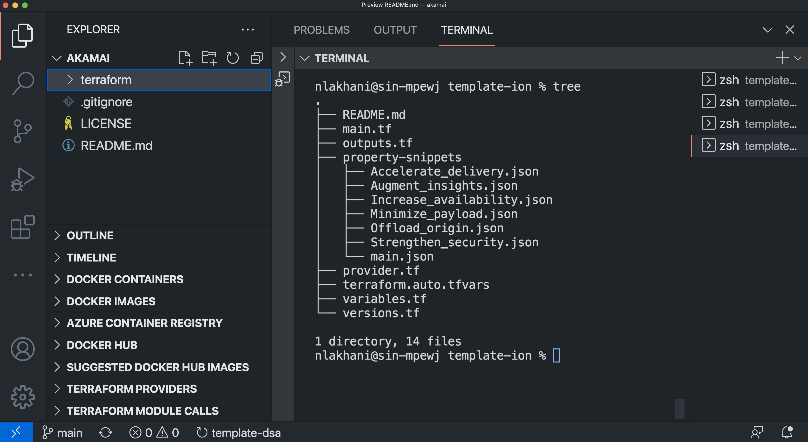
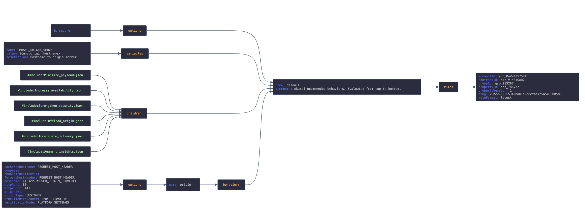

<!-- markdownlint-configure-file {
  "MD013": {
    "code_blocks": false,
    "tables": false
  },
  "MD033": false,
  "MD041": false
} -->

# ION Template

## Description

ION-Template is a Terraform project which enables you to automate onboarding of Akamai Property Manager under product: ION.

## How to use this template?

### Before you begin

 * You need to have API access<br />
 [Create authentication credentials](https://techdocs.akamai.com/developer/docs/set-up-authentication-credentials) | [Setup Akamai Develoment Enviroment](https://techdocs.akamai.com/developer/docs/set-up-authentication-credentials)
 * NOTE: Both Terraform and the Akamai Terraform CLI package come pre-installed in the Akamai Development Environment (Docker image).
 * Setup .edgerc file with your credentials (^)
 * Determine the IDs for your contracts, groups prior to using the API's. Both operations are available through the [Property Manager API](https://techdocs.akamai.com/property-mgr/reference/api) (PAPI) using its [List contracts](https://techdocs.akamai.com/property-mgr/reference/get-contracts) and [List groups](https://techdocs.akamai.com/property-mgr/reference/get-groups) resources.
 * Ensure you have a valid certificate provisioned on Akamai Control Center
 * Ensure you have a development enviroment setup. Minimum: Akamai CLi, Visual Studio Code, Terraform, Git.

 ### Thereafter

* ``` Git clone https://github.com/alilakhani786/akamai.git ``` and open the project in VSCode. You should see the below file structure. <br /><br />

  <br/><br/>
* ```main.tf``` is the entry point where resources: akamai_property, akamai_edge_hostname, akamai_cpcode, akamai_property_activation as well as data sources for group, contract and rules is defined.
* The ```terraform.auto.tfvars``` allows you to customize configuration without altering terraform source code. This is where you define variables such as hostname to be onboarded to Akamai, contract id, group name, etc.

* Review property-snippets folder which contains all the Rules in JSON format. main.json is the default rule / entrypoint to snippets.

  
  <br />property-snippets/main.json chat view (^)
  <br/><br/>

* All the rules and behaviors are nicely broken down into chunks of json for ease of manageability. There is no hard and fast rule to have this structure and you can modify as you see fit. For e.g. Augment_insights.json cosists of all nessasary behaviours related to insights and Offload_origin.json consists of all behaviours related to improving offload. You can edit this as and when you need and run terraform to make updates. you may also add new snippets e.g. edgeworkers.json and add the snippet in main.json.
* TIP: you may copy paste each snippet in http://json2table.com/ to view in grid format to review configuration. 
* Ensure you have .edgerc file and section_name setup in provider.tf file. Ensure all the variables are correctly setup in tfvars.
* Goto root folder of the project and run terraform init, terraform plan, terraform apply. Note: you may want to connect ```akamai_property_activation``` resource in ```main.tf``` for the first run for sanity check as activation takes time. This is how I do it.

## References

* [Akamai Terraform Provider](https://registry.terraform.io/providers/akamai/akamai/latest/docs)
* [Akamai CLi](https://github.com/akamai/cli)
* [Akamai Docker](https://github.com/akamai/akamai-docker)
* [Introduction to Akamai Developer Tools](https://techdocs.akamai.com/developer/docs/welcome-to-the-akamai-developer-documentation-hub)

<!--
### Review
|  |  |  |  |  |  |
|--|--|--|--|--|--|
| Default Rule  |           |               |                             |                           |
|               | Behaviors |               |                             |                           |
|               |           | Origin Server |                             |                           |
|               |           |               | Cache Key Hostname          |  *Incoming Host Header*   |
|               |           |               | Support GZip                |  *Yes*                    |
|               |           |               | Send True Client IP Header  |  *Yes*                    |
|               |           |               | Forward Host Header         |  *Incoming Host Header*   |
|               |           |               | Origin Server Hostname      |  *{Origin Server Hostname}*   |
|               |           |               | HTTP / HTTPS Port           |  *Yes*                    |
|               |           |               | Allow Clients To Set True Client IP Header |  *No*      |
-->


### <br /><div align="center">Happy Terraforming!</div>
<br />

</div>
</div>